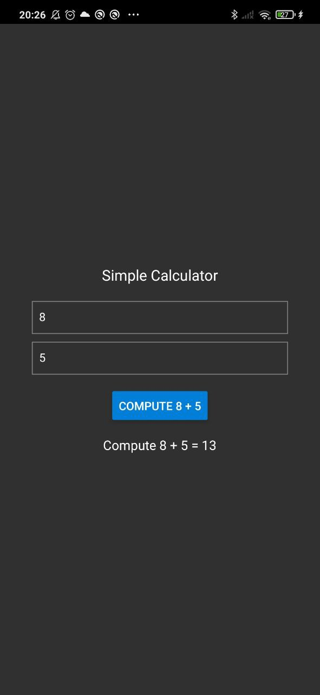
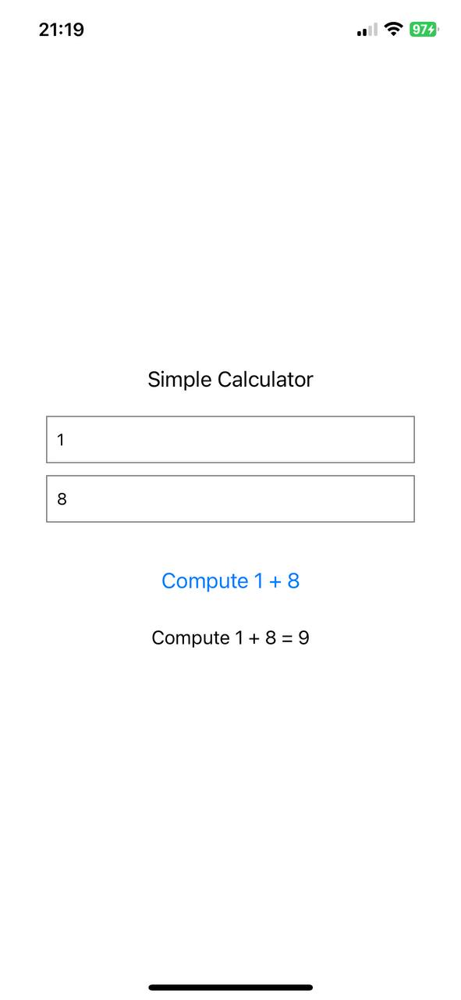

# RTN Calculator
Example of a simple calculator with TurboModules in a React Native app

## Demo

**Android:**



**iOS:**



## Installation

### 1. Setup the Example Project

Navigate to the `example` directory:

```sh
cd example
```

### 2. Add the RTN Calculator Module

Add the rtn-calculator module to the project:

```sh
yarn add ../rtn-calculator
```
### 3. Generate Codegen Artifacts for iOS

Run the following command to generate codegen artifacts for iOS:

```sh
cd ..
node example/node_modules/react-native/scripts/generate-codegen-artifacts.js \
  --targetPlatform ios \
  --path example/ \
  --outputPath rtn-calculator/generated/
```

### 4. Install Dependencies in Example

Return to the example directory and install the rtn calculator module:

```sh
cd example
yarn add ../rtn-calculator
```

### 5. Install CocoaPods for iOS

If you are working with iOS, install the required CocoaPods dependencies:

```sh
cd ios
RCT_NEW_ARCH_ENABLED=1 pod install
```
### 6. Generate Codegen Artifacts for Android

If you are working with Android, generate the required codegen artifacts:

```sh
cd android
./gradlew generateCodegenArtifactsFromSchema
```

## Usage

```js
import RTNCalculator from 'rtn-calculator/js/NativeRTNCalculator';


const App: React.FC = () => {
    const [result, setResult] = useState < number | null > (null);
    const [x, setX] = useState < string > ('');
    const [y, setY] = useState < string > ('');

    const handleCompute = useCallback(async () => {
       const value = await RTNCalculator?.add(x, y);
    }, [x, y]);
}
```
